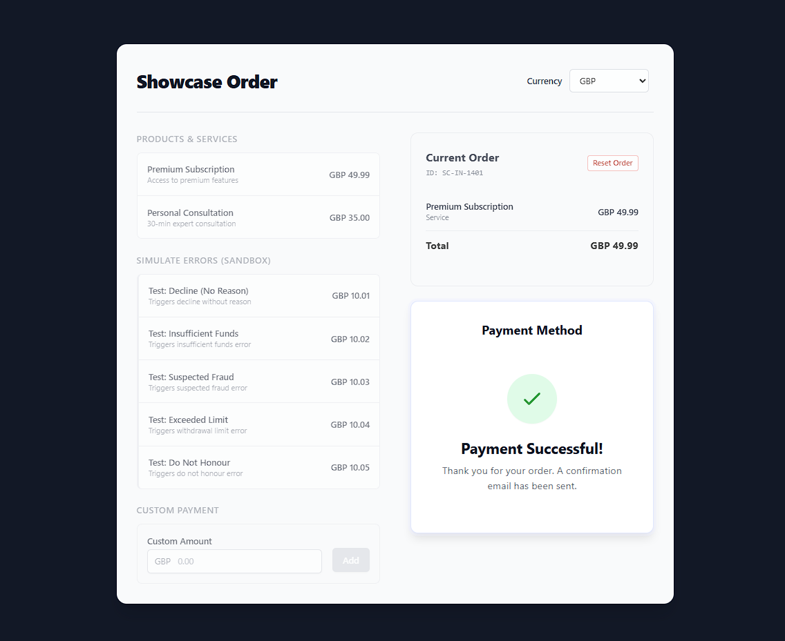

# Revolut Pay Test App

This is a simple application to showcase Revolut Pay integrations. It simulates a simple online checkout to demo different payment scenarios like successful payments, declined cards, or fraud warnings.

## What's inside

-   **Frontend**: A React app that looks like a checkout page
    - `client/src/App.jsx`. This handles the shopping cart and the "Pay" button.
-   **Backend**: A Node.js server that talks to the Revolut API securely.
    - `server/routes/payment.js`. This creates the payment order with Revolut.




## Getting Started

### 1. Installation

You need to install the software libraries for the main folder, the client, and the server. Run these commands in your terminal:

```bash
npm install
npm install --prefix client
npm install --prefix server
```

### 2. Setup

The server needs your Revolut API keys to work.

1.  Go to the `server/` folder.
2.  Create a file named `.env`.
3.  Add your keys inside it like this:

```env
MERCHANT_API_SECRET_KEY=sk_sandbox_your_secret_key_here
MERCHANT_API_PUBLIC_KEY=pk_sandbox_your_public_key_here
MERCHANT_API_URL=https://sandbox-merchant.revolut.com/api/orders
```

### 3. Run it

To start both the website and the server at the same time, run:

```bash
npm run dev
```

-   Open the website at: http://localhost:5173
-   The server runs at: http://localhost:3000

## How to use the test items

The app has a list of "Test Items". If you add these to your cart, the total price changes to a specific amount that tells the Revolut Sandbox how to behave.

| Item Name | What happens? |
|-----------|-------------------|
| **Standard Items** | The payment should work normally. |
| **Test: Decline** | The payment will be declined. |
| **Test: Insufficient Funds** | The payment will fail because there isn't enough money. |
| **Test: Suspected Fraud** | The payment will be flagged as fraud and blocked. |
